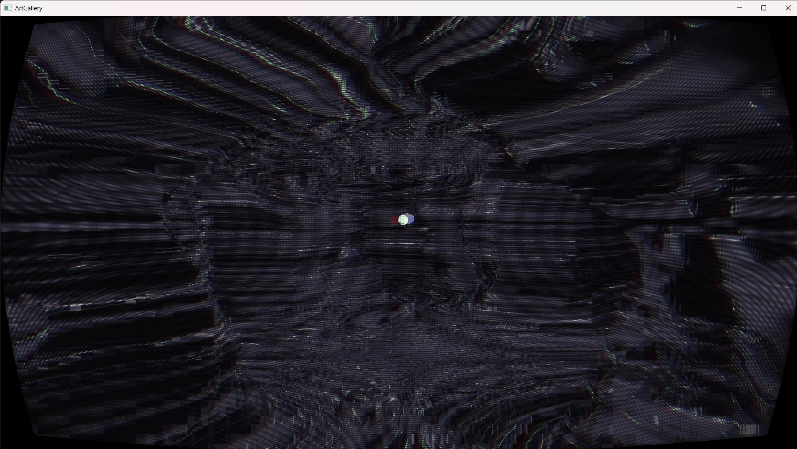
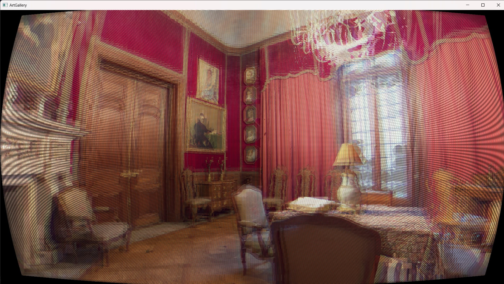

# Art Gallery Project - Graphics & Visual Reality 2024

## Introduction
------------
The Art Gallery program places you in a 3D environment, representing a gallery room with 5 different paintings. But these aren't normal paintings, but interactive portals into a different world! Through
normal mapping, witness intersecting lighting effects between the room represented in the portal and the 
main studio room, or raise the 2D portal images into a relief representation through the technique of
bump mapping. 

Additionally,  teleport into each painting and explore the scene, apply post-processing effects like dithering or a brush-stroke effect to them, and constrast and compare!

## Features & Short Showcase
------------

Here we see, through the paintings of the main gallery room, the Studio Room, the paintings of the Morning Room and the Peirene Fountain. Additional rooms are the Metallic Cave, the Destroyed Room and the Great Drawing Room. If we raise the 2D portal image of the painting of the Great Drawing Room, and apply the Comic Book effect on it, we can admire the painting in a whole new way:

We can also apply to the Peirene Fountain and compare the resulting effect by jumping into each painting!

Another example, is visiting the Metallic Cave and using the CRT effect in it:

Or in the Morning Room:

We can also implement various transitioning effects when jumping into portals, instead of sharp cuts, like blurring:

## List of Features, Techniques and Development Methodologies
------------
- Phong lighting within GLSL.
- Portals into different non-rendered rooms using OpenGL framebuffers.
- Floyd-Steinberg Dithering, both real-time and dithered textures.
- Attempt at Pointillism through black-white sampling in screen space
- Implememtation of the Kuwahara Filter for a painterly effect
- Custom-made Comic Book effect with high contrast, popping colors, outlines and halftones
- Normal mapping, Parallax Mapping and Bump Mapping

## How to
------------
- Download CMake and the program source code
- Build the Visual Studio solution of the source code in a 'build' folder
- Run the program through Visual Studio or the executable

------------
Program Instructions:
>WASD: Move camera \
Q&E: Move up and down \
ENTER: Toggle active Dithering \
SHIFT + ENTER: Toggle active colored Dithering or pre-dithered/original Texture \
P: Toggle Pointilism \
K: Toggle Kuwahara Filter \
C: Toggle Comic Book Effect \
T: Toggle CRT Effect \
N: Toggle Normal Maps \
M: Toggle Parallax Mapping \
R: Raise Mesh \
SHIFT + R: Stop Portal Cameras moving \
0: Disable transitions and 1-7: Select transition effect \
BACKSPACE: Print booleans status \
SHIFT + BACKSPACE: Toggle minimap for debugging \
LEFT/RIGHT ARROW: Change minimap texture \
CTRL: Print Instructions Again \
ESC: Quit 

------------
By Kosmas Archontis, for University of Patras 2024.
