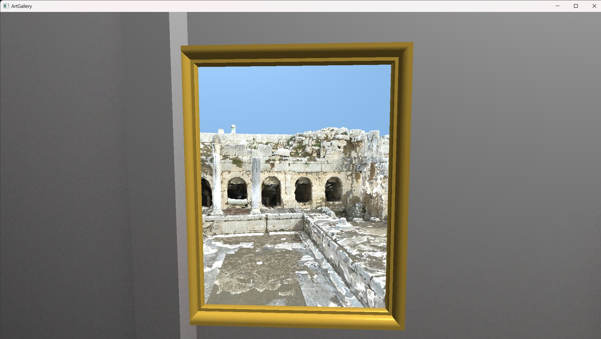

# Art Gallery Project - Graphics & Visual Reality 2024

## Introduction
------------

## How to
------------
- Download CMake and the program source code
- Build the Visual Studio solution of the source code in a 'build' folder
- Run the program through Visual Studio or the executable

------------
Program Instructions:
>WASD: Move camera \
Q&E: Move up and down \
ENTER: Toggle active Dithering \
SHIFT + ENTER: Toggle active colored Dithering or pre-dithered/original Texture \
P: Toggle Pointilism \
K: Toggle Kuwahara Filter \
C: Toggle Comic Book Effect \
T: Toggle CRT Effect \
N: Toggle Normal Maps \
M: Toggle Parallax Mapping \
R: Raise Mesh \
SHIFT + R: Stop Portal Cameras moving \
0: Disable transitions and 1-7: Select transition effect \
BACKSPACE: Print booleans status \
SHIFT + BACKSPACE: Toggle minimap for debugging \
LEFT/RIGHT ARROW: Change minimap texture \
CTRL: Print Instructions Again \
ESC: Quit \

